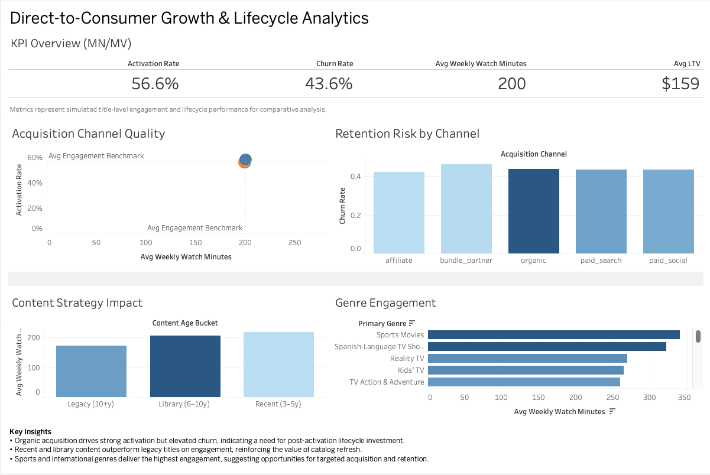
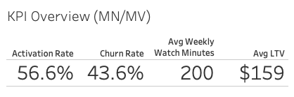
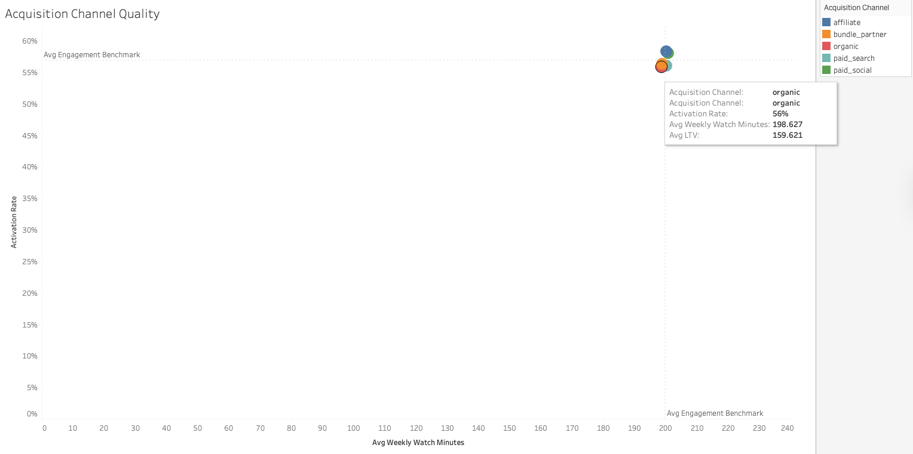
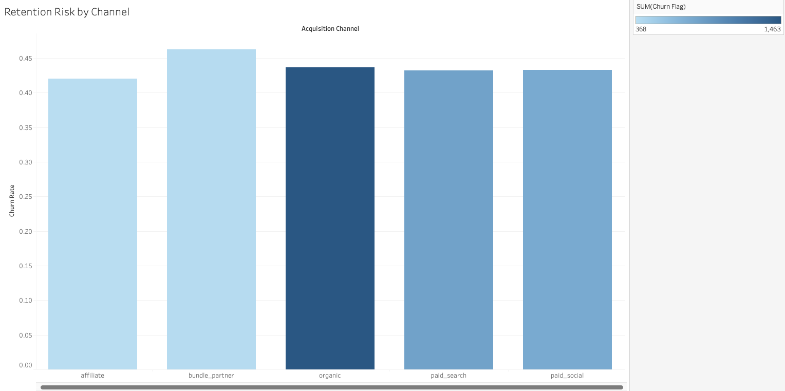
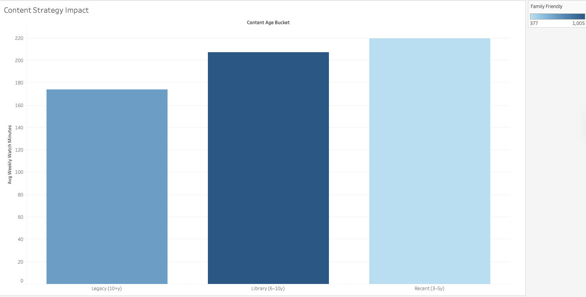
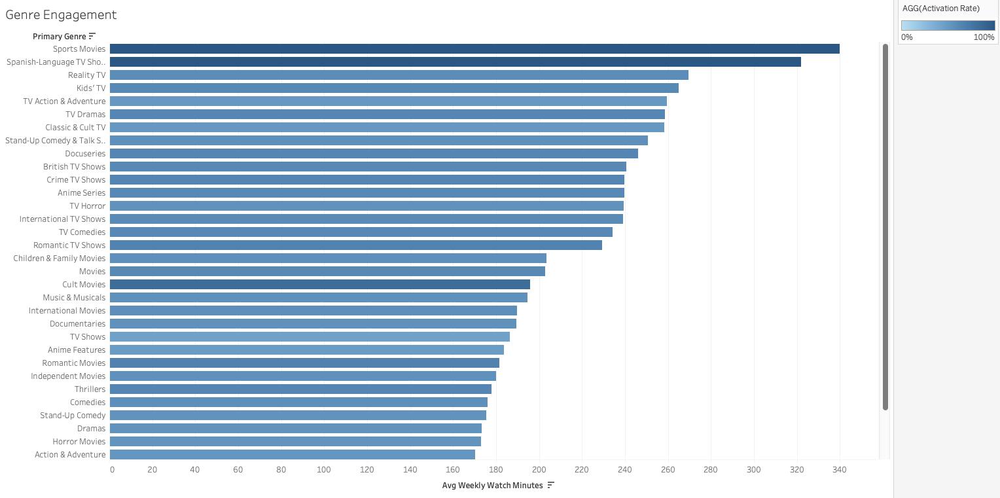

# Direct-to-Consumer Growth & Lifecycle Analytics (Tableau)

## Live Dashboard
**Tableau Public:** <https://public.tableau.com/views/dtc-growth-lifecycle-analytics/Dashboard1?:language=en-US&publish=yes&:sid=&showOnboarding=true&:display_count=n&:origin=viz_share_link>

---

## Project Context

Direct-to-consumer (DTC) businesses live or die by their ability to acquire high-quality subscribers, activate them quickly, sustain engagement, and minimize churn — all while making content investment decisions that support long-term growth.

This project simulates a **DTC growth and lifecycle analytics framework** similar to what would be used for a streaming platform, with a focus on:
- Acquisition channel quality
- Subscriber activation and engagement
- Retention risk
- Content strategy impact on lifecycle outcomes

The goal is not just to report metrics, but to surface **actionable insights** that inform marketing strategy, lifecycle optimization, and content investment decisions.

---

## Key Business Questions

This dashboard was designed to answer questions such as:

- Which acquisition channels drive the *highest-quality* subscribers, not just volume?
- Where do strong activation rates fail to translate into long-term retention?
- How does content age (recent vs. library vs. legacy) influence engagement?
- Which genres are most effective at sustaining weekly watch time?
- Where should DTC teams prioritize lifecycle interventions post-signup?

---

## Metrics & Definitions

The dashboard focuses on core DTC lifecycle metrics:

- **Activation Rate**  
  Percentage of acquired subscribers who meaningfully engage after signup.

- **Churn Rate**  
  Proportion of subscribers modeled to disengage or cancel.

- **Average Weekly Watch Minutes**  
  Proxy for engagement depth and content resonance.

- **Average Lifetime Value (LTV – proxy)**  
  Modeled estimate based on subscription tenure and plan mix.

> *Note: Metrics are simulated at the title level to enable comparative analysis and storytelling.*

---

## Key Insights

- **Organic acquisition channels** demonstrate strong activation performance but elevated churn, highlighting an opportunity for post-activation lifecycle campaigns.
- **Recent and library content** outperform legacy titles in weekly engagement, reinforcing the importance of catalog refresh and ongoing content investment.
- **Sports and international genres** generate the highest engagement, suggesting opportunities for targeted acquisition and retention strategies aligned to content preferences.

---

## Dashboard Walkthrough

### KPI Overview
Executive-level snapshot of activation, churn, engagement, and value metrics, with acquisition channel controls for rapid scenario analysis.

### Acquisition Channel Quality
Scatter plot evaluating acquisition channels by **engagement depth vs. activation**, with benchmark reference lines to identify high-quality growth drivers.

### Retention Risk by Channel
Comparison of churn risk across acquisition sources to identify lifecycle friction points.

### Content Strategy Impact
Analysis of how catalog age influences engagement, supporting content planning and investment decisions.

### Genre Engagement
Ranking of genres by average weekly watch minutes to highlight high-impact content categories.

---

## Tools & Skills Demonstrated

- Tableau (Dashboard Design, KPI Frameworks, Reference Benchmarks)
- Direct-to-Consumer Growth & Lifecycle Analytics
- Marketing Channel Performance Analysis
- Engagement & Retention Modeling
- Executive-level Data Storytelling

---

## Why This Project Matters

Rather than treating analytics as reporting, this project demonstrates how **data can guide strategic DTC decisions** — from acquisition mix and lifecycle investment to content strategy prioritization.

The structure and insights mirror how analytics teams at streaming and consumer subscription businesses support leadership decision-making.

---

## Screenshots

### Full Dashboard

### KPI Overview

### Acquisition Channel Quality

### Retention Risk by Channel

### Content Strategy Impact

### Genre Engagement

